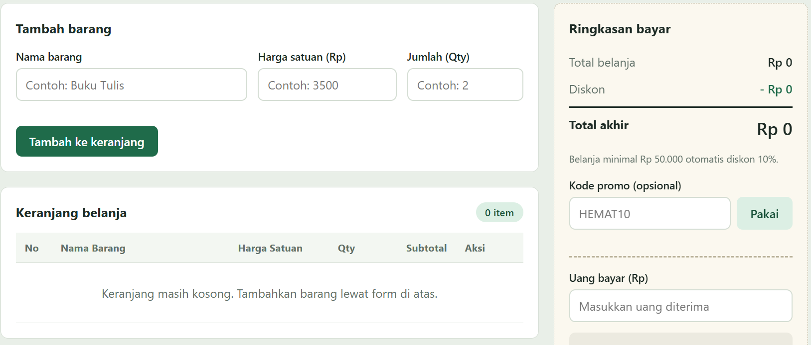
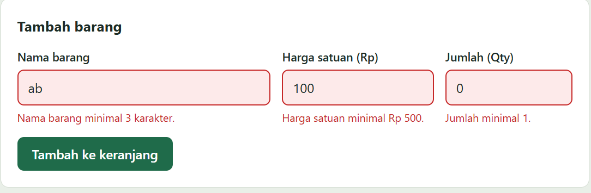
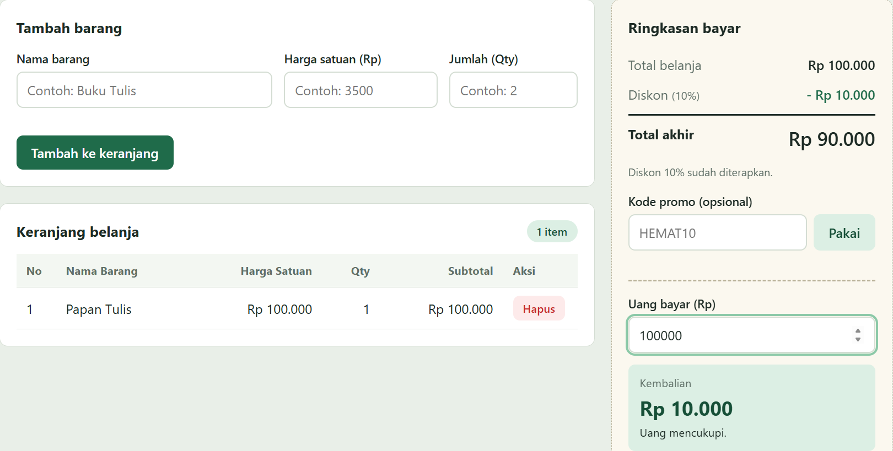

# Mini POS - Aplikasi Kasir & Keranjang Belanja Sederhana

## Identitas

| | |
|---|---|
| **Nama Lengkap** | Shafa Ayutyas Dewi |
| **NIM** | 124140168 |
| **Kelas Praktikum** | RB |

---

## Deskripsi Aplikasi

**Mini POS** adalah aplikasi web kasir sederhana untuk **kantin atau toko kampus**. Kasir dapat mencatat barang yang dibeli pelanggan, melihat total belanja, mendapat diskon otomatis, lalu menghitung kembalian dari uang yang diterima.

**Tujuan pembuatan:** menyatukan tiga kompetensi dasar praktikum dalam satu studi kasus:

1. Validasi input form (nama, harga, qty).
2. Perhitungan kalkulator otomatis (subtotal, total, diskon, kembalian).
3. Manajemen keranjang belanja dengan `localStorage` agar data tidak hilang saat halaman di-refresh.

**Studi kasus:** kasir kantin kampus yang melayani transaksi satu per satu.

---

## Panduan Menjalankan

Aplikasi ini murni HTML, CSS, dan JavaScript, jadi tidak perlu instalasi tambahan.

**Cara 1 - Live Server (VS Code)**

1. Buka folder `mini-pos` di VS Code (`File > Open Folder`).
2. Pasang ekstensi **Live Server** (Ritwick Dey) bila belum ada.
3. Klik kanan `index.html`, pilih **Open with Live Server**.
4. Browser akan terbuka otomatis di `http://127.0.0.1:5500`.

**Cara 2 - Langsung di browser**

1. Buka folder `mini-pos` di File Explorer.
2. Klik dua kali `index.html` (atau seret ke Chrome/Edge/Firefox).

### Struktur Folder

```
mini-pos/
├── index.html      # struktur halaman
├── style.css       # tampilan dan responsivitas
├── script.js       # logika aplikasi
├── README.md       # dokumentasi
└── screenshots/    # tangkapan layar untuk README
```

---

## Daftar Fitur

**Validasi form**
- [x] Nama barang wajib diisi, minimal 3 karakter
- [x] Harga satuan wajib angka dan minimal Rp 500 (0, negatif, atau kosong ditolak)
- [x] Qty wajib bilangan bulat minimal 1
- [x] Pesan error merah tampil di bawah input yang salah
- [x] Barang tidak masuk keranjang bila ada input tidak valid
- [x] Form otomatis di-reset setelah barang berhasil ditambahkan

**Kalkulator**
- [x] Subtotal per baris = harga x qty
- [x] Total belanja dihitung otomatis dari seluruh subtotal
- [x] Diskon 10% otomatis jika total belanja minimal Rp 50.000
- [x] Kode promo `HEMAT10` (diskon 10%, tidak ditumpuk dengan diskon otomatis)
- [x] Nominal diskon dan total akhir ditampilkan
- [x] Input uang bayar dengan kembalian otomatis
- [x] Keterangan "Uang belum mencukupi" bila uang kurang
- [x] Format Rupiah (contoh: Rp 15.000)

**Keranjang & localStorage**
- [x] Tabel keranjang (No, Nama Barang, Harga Satuan, Qty, Subtotal, Aksi)
- [x] Tombol Hapus per baris, total dan diskon terhitung ulang otomatis
- [x] Keranjang disimpan dengan `JSON.stringify()` dan dimuat dengan `JSON.parse()`
- [x] Isi keranjang tetap ada setelah refresh
- [x] Tombol **Transaksi baru** mengosongkan keranjang dan `localStorage`
- [x] Tampilan responsif (desktop, tablet, ponsel)

---

## Tangkapan Layar

### 1. Tampilan form input utama
Form tambah barang dalam keadaan kosong, tabel keranjang kosong, dan ringkasan bayar Rp 0.



### 2. Tampilan saat validasi error muncul
Input nama "ab", harga 100, dan qty 0 ditolak. Pesan error merah muncul di bawah setiap input yang salah dan barang tidak masuk ke keranjang.



### 3. Tampilan hasil perhitungan dan tabel keranjang
Barang "Papan Tulis" (Rp 100.000 x 1) masuk tabel keranjang. Total belanja Rp 100.000 mendapat diskon 10% sehingga total akhir Rp 90.000. Dengan uang bayar Rp 100.000, kembalian otomatis Rp 10.000.



---

## Penjelasan Teknis Singkat

### 1. Penanganan validasi input

Saat form di-submit, `e.preventDefault()` menahan pengiriman bawaan browser. Fungsi `validasiForm()` memanggil tiga fungsi validasi terpisah:

- `validasiNama()` - nilai di-`trim()`, lalu dicek tidak kosong dan panjang minimal 3.
- `validasiHarga()` - dicek tidak kosong, bisa diubah ke angka (`Number()`), dan minimal 500.
- `validasiQty()` - dicek tidak kosong, berupa angka, bilangan bulat (`Number.isInteger()`), dan minimal 1.

Setiap fungsi mengembalikan **pesan error** (string) atau string kosong jika valid. Jika ada pesan, `tampilkanError()` memberi kelas `invalid` pada input dan menulis pesan merah di bawahnya. Jika ada satu saja yang gagal, `validasiForm()` mengembalikan `false` sehingga `tambahBarang()` tidak dijalankan. Jika semua valid, barang ditambahkan lalu `formBarang.reset()` mengosongkan form. Pesan error juga hilang otomatis saat pengguna mulai mengetik ulang.

### 2. Algoritma kalkulator

| Perhitungan | Rumus | Fungsi |
|---|---|---|
| Subtotal | `harga x qty` | `hitungSubtotal()` |
| Total belanja | jumlah semua subtotal (`reduce`) | `hitungTotalBelanja()` |
| Diskon | `10% x total` jika total >= 50.000 atau promo `HEMAT10` aktif, selain itu 0 | `hitungDiskon()` |
| Total akhir | `total - diskon` | `tampilkanRingkasan()` |
| Kembalian | `uang bayar - total akhir` | `tampilkanKembalian()` |

Jika `uang bayar < total akhir`, kotak kembalian berubah menjadi peringatan kuning bertuliskan "Uang belum mencukupi" beserta nominal kekurangannya. Semua angka ditampilkan dengan `Intl.NumberFormat("id-ID")` melalui `formatRupiah()`. Ringkasan dihitung ulang setiap kali keranjang berubah, kode promo dipakai, atau uang bayar diketik.

### 3. Mekanisme serialisasi localStorage

Keranjang disimpan sebagai array of object `{ nama, harga, qty }` di state `keranjang`.

- **Menyimpan:** `simpanKeranjang()` memanggil `localStorage.setItem("miniPosKeranjang", JSON.stringify(keranjang))` setiap kali barang ditambah atau dihapus. `JSON.stringify()` mengubah array menjadi string karena localStorage hanya menyimpan teks.
- **Memuat:** saat halaman dibuka, `muatKeranjang()` mengambil string dengan `getItem()` lalu mengubahnya kembali menjadi array dengan `JSON.parse()`. Blok `try...catch` menjaga aplikasi tetap jalan bila data rusak.
- **Mengosongkan:** `resetTransaksi()` mengosongkan array dan memanggil `localStorage.removeItem()`.

Nama barang ditampilkan memakai `textContent` (bukan `innerHTML`) agar aman dari injeksi HTML.
